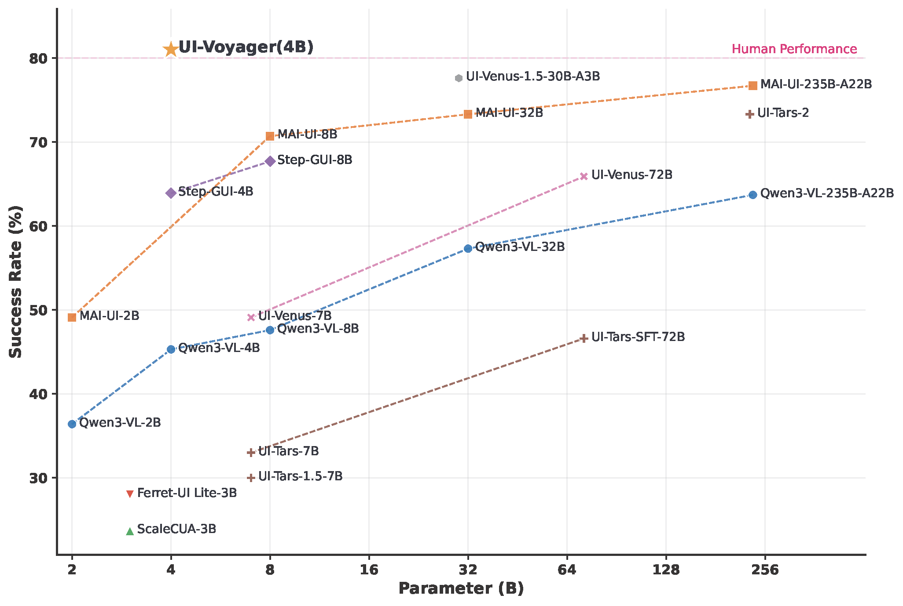

# **UI-Voyager**: A Self-Evolving GUI Agent Learning via Failed Experience


<p align="center">
  <a href="https://arxiv.org/pdf/2603.24533"></a>
  <a href="https://huggingface.co/MarsXL/UI-Voyager"></a>
</p>


We present **UI-Voyager**, a novel two-stage self-evolving mobile GUI agent. Our 4B model achieves a **81.0%** success rate on [AndroidWorld](https://github.com/google-research/android_world) benchmark, outperforming numerous recent baselines and exceeding human-level
performance.

<p align="center">
  
  <br>
  <em>Overview of UI-Voyager performance on AndroidWorld</em>
</p>


## News
* **[2025.03.26]**  **Paper**: Our paper is now available on [arXiv](https://arxiv.org/pdf/2603.24533).
* **[2025.03.26]**  **Model Release**: [UI-Voyager](https://huggingface.co/MarsXL/UI-Voyager) is released on HuggingFace.

## Table of Contents


- [🚀 Quick Start](#quick-start)
- [🔧 Evaluation](#evaluation)
- [📋 Logs and test results](#logs-and-test-results)
- [📝 Citation](#citation)


## Quick Start

### 1. Prepare an Android emulator (AVD)

You must have an Android Virtual Device (AVD) available for emulator startup.
For AVD creation and emulator setup, you can follow the AndroidWorld installation guide: [google-research/android_world](https://github.com/google-research/android_world), [google-deepmind/android_env](https://github.com/google-deepmind/android_env).

By default, scripts assume:

- `AVD_NAME=AndroidWorldAvd`
- your emulator binary is at `/root/android/emulator/emulator`

If your setup differs, override these variables when running `run_android_world.sh` (see below).

### 2. Install Dependencies

```bash
pip install -r androidworld/requirements.txt
python3 android_env/setup.py install
```

### 3. Start Model API Service with vLLM

Download the model from HuggingFace:
```bash
huggingface-cli download --resume-download MarsXL/UI-Voyager --local-dir /path/to/ui-voyager
```

Deploy the model using vLLM:
```bash
vllm serve /path/to/ui-voyager \ 
  --served-model-name UI-Voyager \
  --host 0.0.0.0 \
  --port 8080 \
  --tensor-parallel-size 1
```

The default YAML (`androidworld/eval/configs/UI-Voyager.yaml`) uses:

- `llm.base_url: http://localhost:8000`
- `llm.model: UI-Voyager`

### 4. Start evaluation (parallel emulators)

```bash
NUM_WORKERS=4 CONFIG_NAME=UI-Voyager ./run_android_world.sh
```

### 5. Monitor and stop

After `./run_android_world.sh` returns, it prints the **main PID**, the **main log file path**, and the **output (artifacts) directory**. Use those paths directly.

To stop a running evaluation, prefer passing the **log directory of that run** (the folder that contains `eval.pid`):

```bash
./stop_android_world.sh /path/to/eval_results/<MODEL_NAME>/logs/<timestamp>
```

If you call `./stop_android_world.sh` with no arguments, it may not resolve the correct `logs/<timestamp>` folder; in that case stop manually:

```bash
kill "$(cat eval_results/<MODEL_NAME>/logs/<timestamp>/eval.pid)"
```

## Evaluation

Default config:

`androidworld/eval/configs/UI-Voyager.yaml`

Key sections:

- `env.*`: emulator/ports/ADB paths
- `llm.*`: OpenAI-compatible endpoint + model name
- `agent.*`: prompt name, action loop params, history length, SFT output dir
- `eval.*`: which AndroidWorld task suite to run and the output path

Parallel evaluation entrypoint:

`python test_android_world.py --config <yaml> --num_workers <N> ...`


## Logs and test results

### Directory layout (`run_android_world.sh`)

| Path | Contents |
|------|----------|
| `eval_results/<MODEL_NAME>/logs/<TIMESTAMP>/` | All logs and merged summaries for that launch |
| `eval_results/<MODEL_NAME>/results/<TIMESTAMP>/` | Runtime `config.yaml` (script patches `sft_data_dir` here) and optional SFT rollouts |


## Citation

If you find this work useful, please consider giving a star 🌟 and citation:

```bibtex
@misc{lin2026uivoyager,
      title={UI-Voyager: A Self-Evolving GUI Agent Learning via Failed Experience}, 
      author={Zichuan Lin and Feiyu Liu and Yijun Yang and Jiafei Lyu and Yiming Gao and Yicheng Liu and Zhicong Lu and Yangbin Yu and Mingyu Yang and Junyou Li and Deheng Ye and Jie Jiang},
      year={2026},
      eprint={2603.24533},
      archivePrefix={arXiv},
      primaryClass={cs.LG},
      url={https://arxiv.org/abs/2603.24533}, 
}
```


